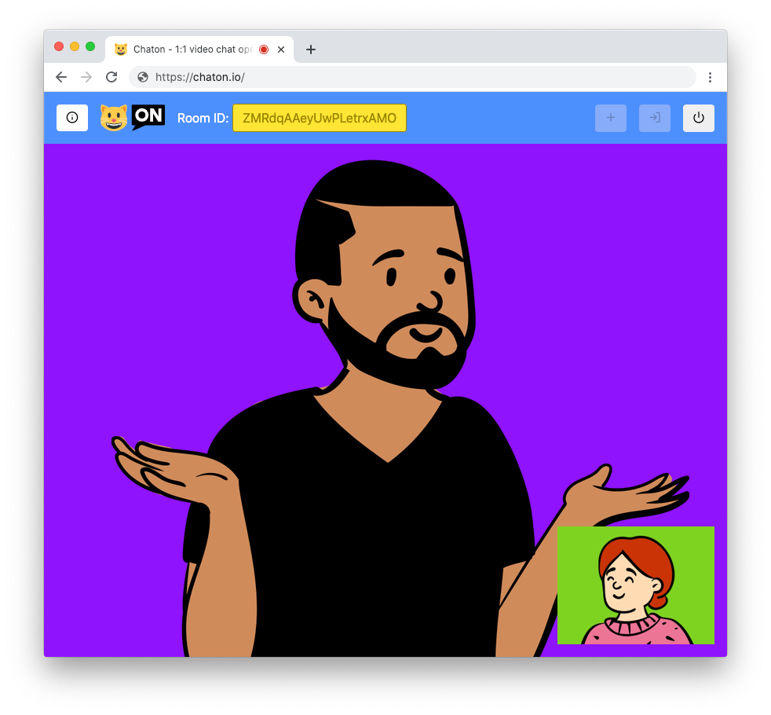

# Chaton

## Introduction
Chaton is a simple 1:1 video chat, full open source. You can create a room and share the ID with an another person for chat together.

It's built with WebRTC technology, for a peer-to-peer exchange, without registration.

## Features
- Written without frameworks, **full Vanilla Typescript**
- Built with **WebRTC** standard
- Compiled with **Parcel**, hosted and deployed with **Firebase**

## Credits
- The emoji cat from logo has created by [Twemoji](https://twemoji.twitter.com/)
- The icons are created by [Feather](https://feathericons.com/), and the fonts are generated by [Icomoon](https://icomoon.io/)
- The screenshot presentation created on [Blush](https://blush.design/) with [Pablo Stanley](https://www.pablostanley.com/) illustrations
